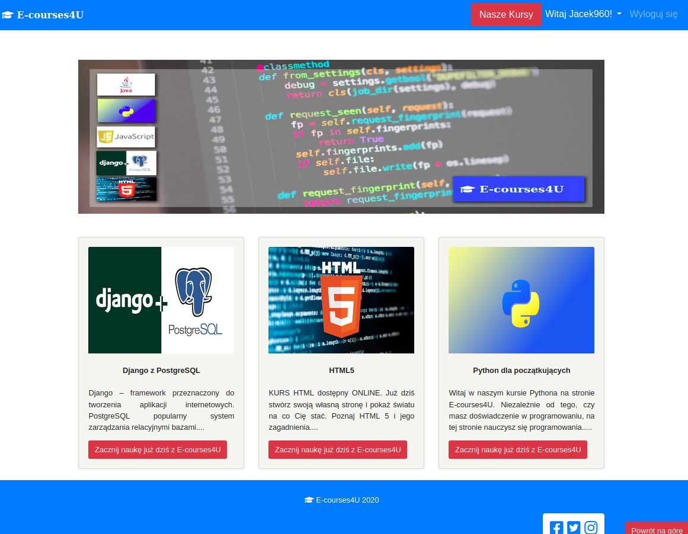
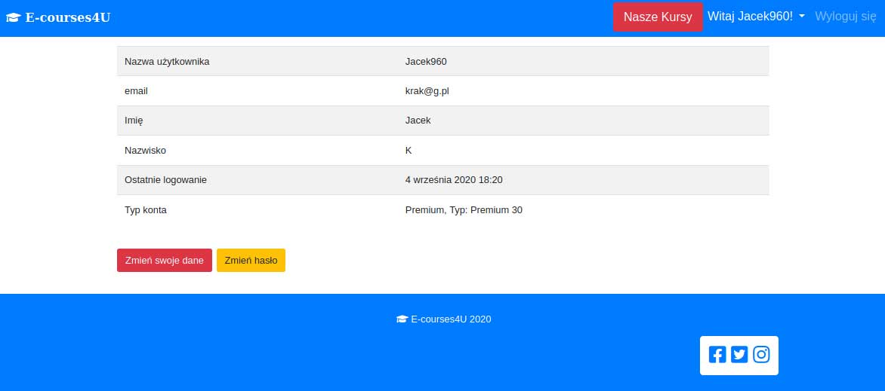
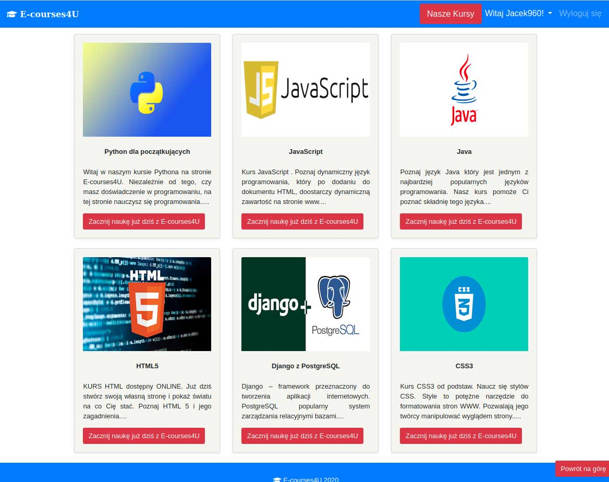
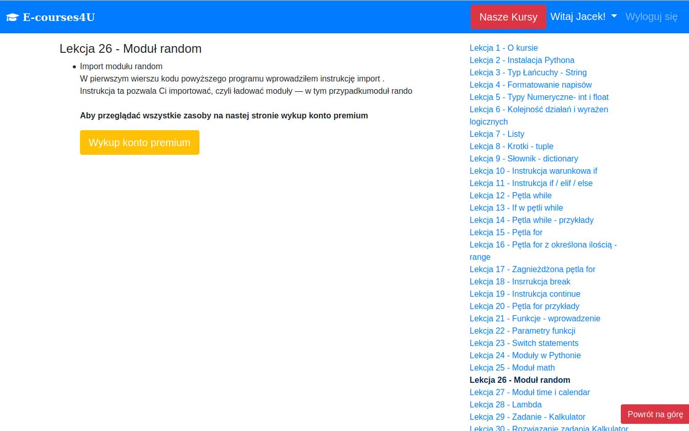
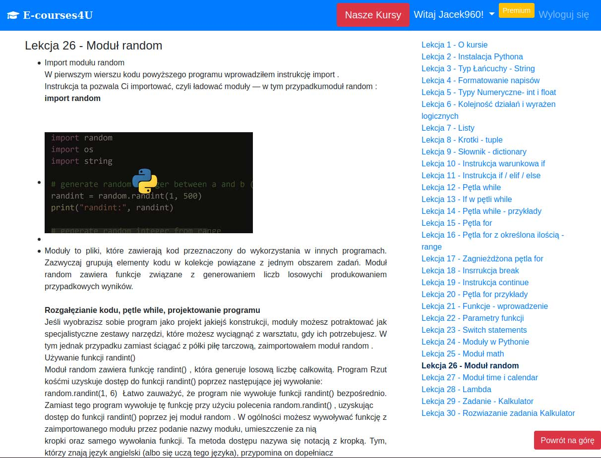

# E-Learning platform
> E-learning platform with free and premium access

## Table of contents
* [General info](#general-info)
* [Screenshots](#screenshots)
* [Technologies](#technologies)
* [Setup](#setup)
* [Features](#features)
* [Status](#status)
* [Credits](#credits)
* [Contact](#contact)

## General info
E-learning platform with free and premium access

## Screenshots
Home Page

Profile

All Courses Page

NO Premium content Page

Premium content Page

## Technologies
* Django 3.1
* Python 3.8
* Bootstrap 4

## Setup
Use pip installation to install dependencies from requirements.txt
## Code requirements.txt

`$ pip install -r requirements.txt`

## Features
To-do list:
* Online payments access  

## Status
Project is: _in progress_, More to be add

## Credits
Photos for project used from [Unsplash](https://unsplash.com/) Thank you all!
Banner photo by <a href="https://unsplash.com/@cdr6934">Chris Ried</a> on <a href="https://unsplash.com/s/photos/code?utm_source=unsplash&amp;utm_medium=referral&amp;utm_content=creditCopyText">Unsplash</a>

## Contact
Created by [Jacek960](mailto:j.kuciel@outlook.com)- feel free to contact me!

